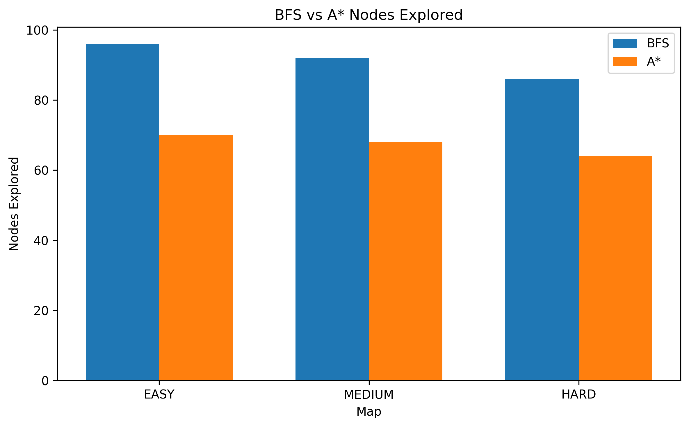
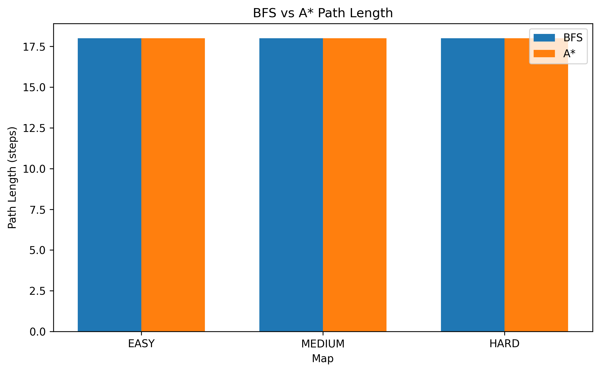
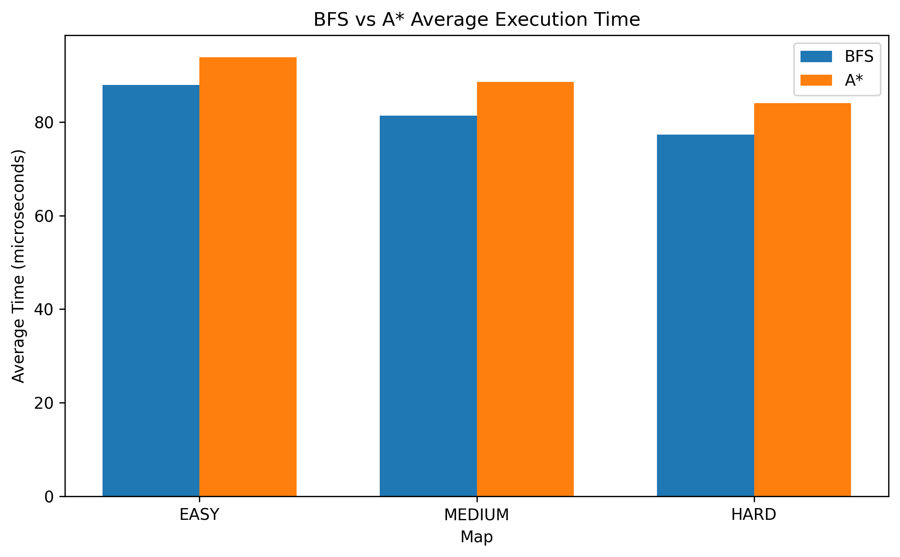
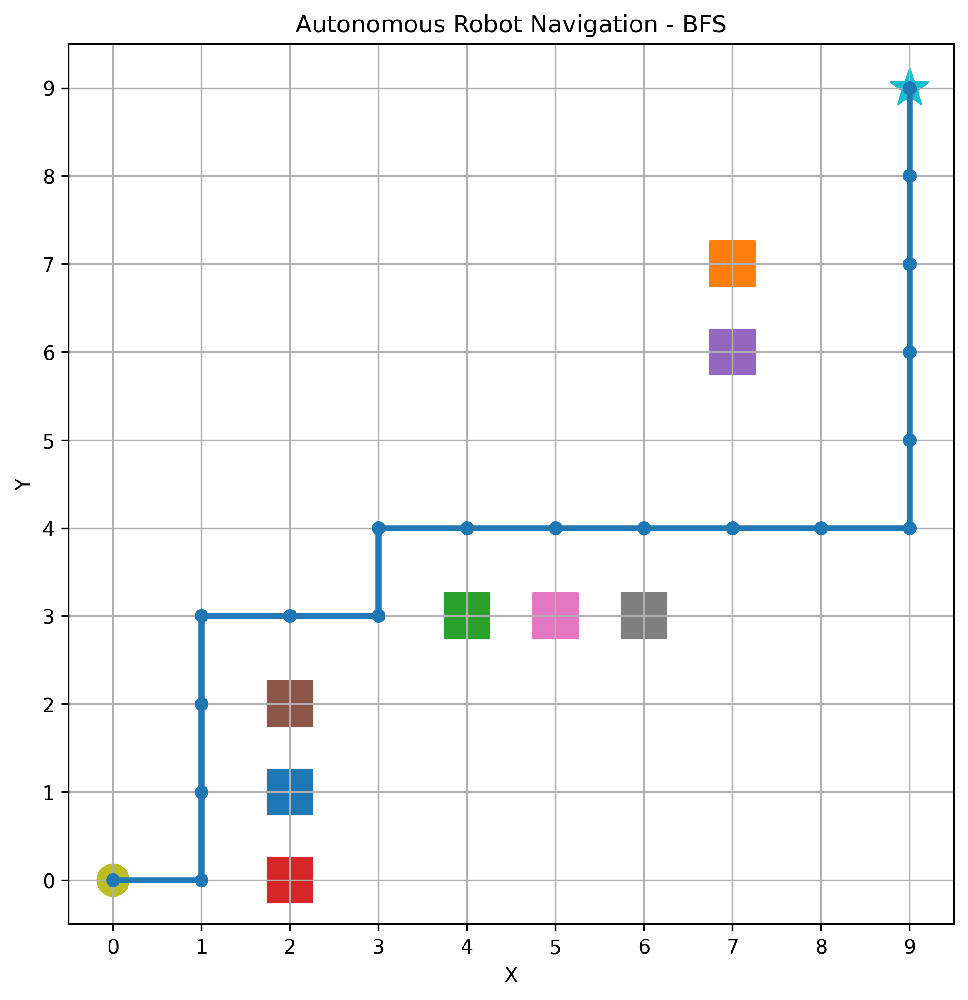

# 🤖 Autonomous Robot Navigation

A Python-based autonomous robot navigation project that explores **path planning, obstacle avoidance, and algorithmic search** in a simulated 2D grid environment.

The project implements and evaluates two classical path planning algorithms:

* **Breadth-First Search (BFS)**
* **A* (A-Star) Search**

The algorithms are tested across multiple environments and compared using:

* Path length
* Nodes explored
* Average execution time

The project demonstrates how heuristic search can reduce unnecessary exploration while maintaining shortest-path performance.

---

## 🎯 Project Overview

The robot operates in a **10×10 grid environment** containing obstacles.

For every map:

* Start position: `(0, 0)`
* Goal position: `(9, 9)`
* Movement: Up, Down, Left, Right
* Obstacles: Non-traversable cells
* Objective: Find a shortest valid path from the start to the goal

Three different environments are currently available:

* **Easy**
* **Medium**
* **Hard**

This project provides a foundation for studying:

**Artificial Intelligence → Search Algorithms → Path Planning → Autonomous Systems → Robotics**

---

## 🧠 Algorithms

### Breadth-First Search (BFS)

BFS explores the environment level by level.

Because every movement has the same cost, BFS is guaranteed to find a shortest path in this grid environment.

However, it does not use information about the location of the goal, so it may explore many unnecessary nodes.

### A* Search

A* combines the cost of reaching a position with an estimate of the remaining distance to the goal.

The project uses **Manhattan distance** as its heuristic:

```text
h(n) = |x₁ - x₂| + |y₁ - y₂|
```

This guides the search toward the goal and reduces unnecessary exploration.

---

## 🗺️ Environment Maps

The navigation environment supports three obstacle configurations:

| Map    | Description                         |
| ------ | ----------------------------------- |
| Easy   | Low obstacle density                |
| Medium | Moderate obstacle density           |
| Hard   | More complex obstacle configuration |

All three environments are designed to contain a valid path from the start to the goal.

---

## 📊 Benchmark Results

Both algorithms successfully found a shortest path of **18 movement steps** in all three environments.

### Nodes Explored

| Map    | BFS | A* | A* Reduction |
| ------ | --: | -: | -----------: |
| Easy   |  96 | 70 |        27.1% |
| Medium |  92 | 68 |        26.1% |
| Hard   |  86 | 64 |        25.6% |

Across all environments, A* explored approximately **26% fewer nodes** than BFS while maintaining the same path length.



### Path Length

Both algorithms consistently found an **18-step shortest path**.



### Execution Time

Average execution time was measured over **1,000 runs** for each algorithm and environment.

| Map    |      BFS |       A* |
| ------ | -------: | -------: |
| Easy   | 87.92 μs | 93.83 μs |
| Medium | 81.35 μs | 88.53 μs |
| Hard   | 77.26 μs | 83.99 μs |



Although A* explored fewer nodes, it was slightly slower in this experiment.

This is expected for a small 10×10 grid because A* introduces additional computational overhead from:

* Heuristic evaluation
* Priority queue operations
* Maintaining path costs

Therefore, **fewer explored nodes do not necessarily translate into lower execution time in very small environments**.

For larger search spaces, the reduction in unnecessary exploration becomes increasingly relevant.

---

## 🗺️ Navigation Visualization

The project also generates a visualization of the planned robot trajectory.



The visualization shows:

* The robot's starting position
* The goal position
* Obstacles
* The calculated navigation path

---

## 📁 Project Structure

```text
autonomous-robot-navigation/
│
├── data/
├── notebooks/
│
├── results/
│   ├── navigation_path.png
│   ├── path_length_comparison.png
│   ├── nodes_explored_comparison.png
│   └── execution_time_comparison.png
│
├── src/
│   ├── grid_world.py
│   ├── path_planner.py
│   ├── astar_planner.py
│   ├── compare_planners.py
│   └── visualize.py
│
└── README.md
```

---

## 🛠️ Technologies & Concepts

### Programming

* Python
* Object-Oriented Programming
* Modular project structure

### Algorithms

* Breadth-First Search
* A* Search
* Heuristic Search
* Manhattan Distance
* Graph Traversal

### Data & Visualization

* Matplotlib
* Algorithm benchmarking
* Performance analysis
* Data visualization

### Tools

* Git
* GitHub
* VS Code

---

## 🚀 How to Run

Clone the repository:

```bash
git clone git@github.com:negingolkar/autonomous-robot-navigation.git
```

Navigate to the project:

```bash
cd autonomous-robot-navigation
```

### Run the Grid World

```bash
python3 src/grid_world.py
```

### Run BFS

```bash
python3 src/path_planner.py
```

### Run A*

```bash
python3 src/astar_planner.py
```

### Run the Full Benchmark

```bash
python3 src/compare_planners.py
```

The benchmark evaluates BFS and A* across:

```text
Easy
Medium
Hard
```

and generates:

```text
results/path_length_comparison.png
results/nodes_explored_comparison.png
results/execution_time_comparison.png
```

### Generate Navigation Visualization

```bash
python3 src/visualize.py
```

This generates:

```text
results/navigation_path.png
```

---

## 🔬 Key Findings

The experiments demonstrate three main findings:

**1. Both algorithms found optimal paths.**

BFS and A* consistently found an 18-step path across all tested environments.

**2. A* significantly reduced search exploration.**

A* explored approximately 26% fewer nodes than BFS across the tested maps.

**3. Search efficiency and execution time are not always identical.**

Despite exploring fewer nodes, A* had slightly higher execution time on these small grids because of heuristic and priority-queue overhead.

This highlights an important principle in algorithm evaluation:

> Algorithm performance should be evaluated using multiple metrics rather than a single measure.

---

## 🔮 Future Improvements

Possible extensions include:

* Larger and procedurally generated environments
* Dynamic obstacles
* Weighted terrain and movement costs
* Additional path planning algorithms such as Dijkstra
* More extensive statistical benchmarking
* Real-time robot simulation
* Computer Vision-based obstacle detection
* Reinforcement Learning for navigation
* ROS integration
* Real-world robotic platform integration

---

## 👩‍💻 Author

**Negin Golkar**

MSc Data Science and Engineering
Politecnico di Torino

**Interests:**
Artificial Intelligence • Machine Learning • Robotics • Computer Vision • Autonomous Systems • Aerospace
